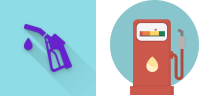
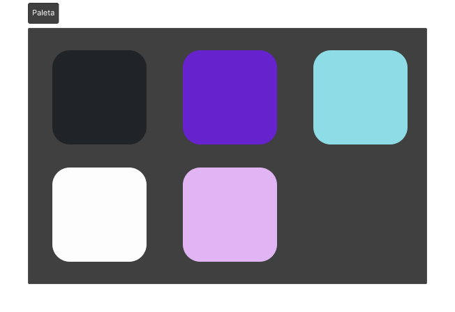
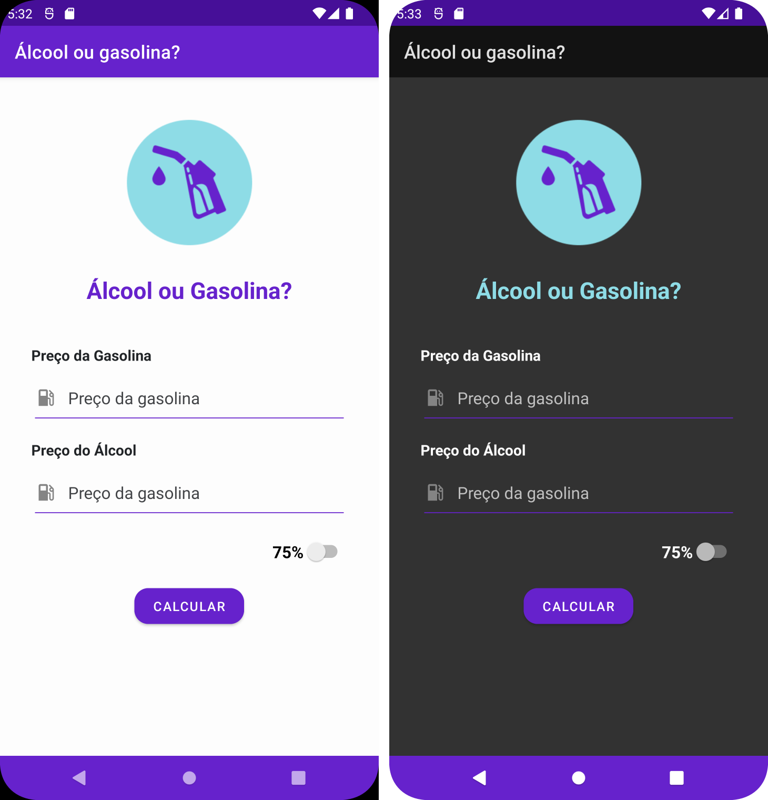

# Álcool ou Gasolina? :fuelpump:

> **Aluna:** Yanna Torres
> 
> **Matrícula:** 507773
> 
> **Disciplina:** Programação para Dispositivos Móveis (SMD0122)
> 
> **Professor:** Dr. Windson Viana

## A atividade :page_with_curl:

Você deve fazer um aplicativo que facilite a vida de quem vai decidir se vai usar Álcool ou Gasolina no carro. Ele pode ter apenas uma única tela conforme mostrado. Você pode usar o [código base](https://github.com/windcarvalho/AlcoolOuGasolina) fornecido pelo professor ou construir o seu. 
As features principais são:
1. **(2 pontos)** - Por enquanto, o aplicativo calcula qual dos combustíveis é o melhor baseado em dois tipos de cálculo: O álcool para ser rentável deve ter 70% ou 75% do valor da gasolina.
2. **(2 pontos)** - O app deve ter um ícone distinto do projeto do professor
3. **(2 pontos)** - As cores dos temas escuro e padrão devem ser modificados e deve ocorrer melhoria no Layout dos componentes
4. **(2 pontos)** - Ao clicar no switch, o valor de uma variável de cálculo deve ser mudada. 
5. **(2 pontos)** - A variável usada para o cálculo do percentual deve ser salva e recuperada no onCreate

---

## Cálculo do melhor combustível :oncoming_automobile:

O código a seguir manipula o que foi escrito nos campos de texto e realiza o cálculo dos valores inseridos de acordo com a variável global `percentual`, que muda de acordo com o Switch e seu valor inicial é `0.70`.

Também foi adicionado um tratamento de erro na hora do cálculo, pois caso um dos campos de texto estiver vázio, é acionado um alerta e não é realizado nenhum cálculo, sendo que o próprio cálculo só é realizado ao clicar no botão.

```kotlin
// váriaveis globais
private var percentual:Double = 0.7

private lateinit var btCalc : Button
private lateinit var gasEdtTxt : EditText
private lateinit var alcEdtTxt : EditText
private lateinit var resTxt : TextView
private lateinit var swPercent : Switch
```

```kotlin
override fun onCreate(savedInstanceState: Bundle?) {
    super.onCreate(savedInstanceState)
    setContentView(R.layout.activity_main)
    Log.d("PDM23","No onCreate, $percentual")

    btCalc = findViewById(R.id.btCalcular)
    gasEdtTxt = findViewById(R.id.edGasolina)
    alcEdtTxt = findViewById(R.id.edAlcool)
    resTxt = findViewById(R.id.result)
    swPercent= findViewById(R.id.swPercentual)

    btCalc.setOnClickListener(View.OnClickListener {
        if (gasEdtTxt.text.isNotEmpty() and alcEdtTxt.text.isNotEmpty()) {
            var gasPrice: Double = gasEdtTxt.text.toString().toDouble()
            var etanolPrice: Double = alcEdtTxt.text.toString().toDouble()
            if(etanolPrice <= percentual*gasPrice) {
                resTxt.setText("Álcool vale a pena!")
            } else {
                resTxt.setText("Álcool NÃO vale a pena!")
            }
        } else {
            resTxt.setText("Insira valores válidos")
        }
    })

    swPercent.setOnCheckedChangeListener { compoundButton, isChecked ->
        percentual = if (!isChecked) {
            0.7
        } else {
            0.75
        }
    }
}
```

---

## Ícone e Paleta de Cores :paintbrush:

### Ícone :framed_picture:

Como pedido, o ícone do aplicativo mudou. O novo é um bico de abastecimento, retirado do site [Flaticon](https://www.flaticon.com/br/icone-gratis/combustivel_1505662?term=gasolina&page=1&position=18&origin=search&related_id=1505662), que fornece ícones de forma gratuita.



### Paleta de Cores :art:

As cores mudaram também, seguindo a paleta base a seguir:



### Novo layout e temas :woman_artist:

Com base nos dois tópicos anteriores e na tela já existente, os temas _claro_ e _escuro_ foram mudados e também ocorreu melhoria nos campos de texto, sendo adicionado um ícone.



---

## Usando o SharedPreferences :selfie:

Por fim, foi implementado o mecanismo de Shared Preferences para guardar o valor escolhido no Switch, salvando e recuperadando no `onCreate`. Em comparação ao código na seção "Cálculo do melhor combustível", adicionasse mais duas váriaveis globais e mudasse um pouco da lógica interna do `onCreate`, pois é necessário recuperar os estados.

```kotlin
// váriaveis globais
private var isSwitchChecked: Boolean = false
private lateinit var sharedPreferences : SharedPreferences
```

```kotlin
override fun onCreate(savedInstanceState: Bundle?) {
    sharedPreferences = getSharedPreferences("MyPrefs", Context.MODE_PRIVATE)
    percentual = sharedPreferences.getFloat("percentual", 0.7F).toDouble()
    isSwitchChecked = sharedPreferences.getBoolean("switchChecked", false)

    // Restante do código...
    swPercent.isChecked = isSwitchChecked
    
    // Restante do código...
    
    swPercent.setOnCheckedChangeListener { compoundButton, isChecked ->
        percentual = if (!isChecked) {
            0.7
        } else {
            0.75
        }
        isSwitchChecked = isChecked

        sharedPreferences.edit()
            .putFloat("percentual", percentual.toFloat())
            .putBoolean("switchChecked", isSwitchChecked)
            .apply()
    }
}
```